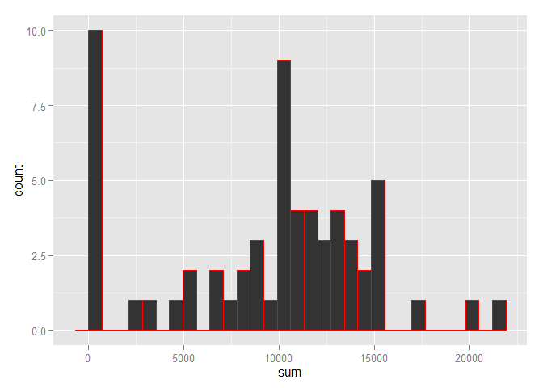
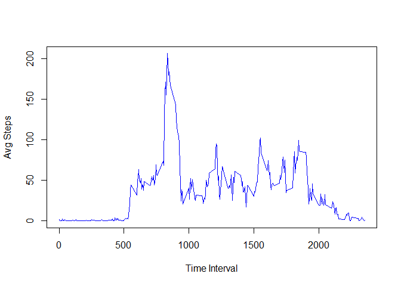
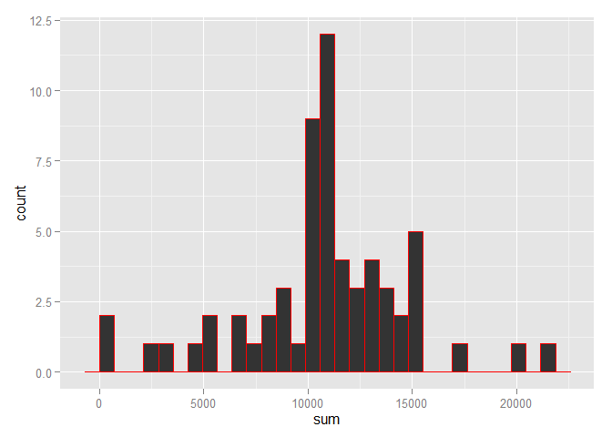
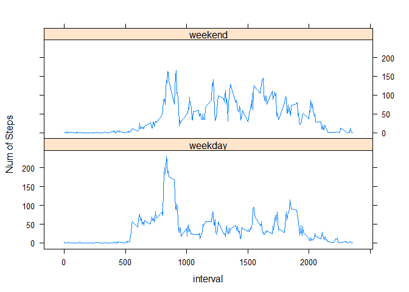

# Reproducible Research: Peer Assessment 1


## Loading and preprocessing the data

```r
library(plyr)
library(ggplot2)
library(chron)
dat <- read.csv("activity.csv", header=TRUE, sep=",", stringsAsFactors = FALSE)
dat$date <- as.Date(dat$date, "%Y-%m-%d")
```


## What is mean total number of steps taken per day?

###Total number of steps taken per day 

```r
stpsPerDay <-  ddply(dat,.(date), summarise, sum=sum(steps, na.rm=TRUE))
stpsPerDay
```

```
##          date   sum
## 1  2012-10-01     0
## 2  2012-10-02   126
## 3  2012-10-03 11352
## 4  2012-10-04 12116
## 5  2012-10-05 13294
## 6  2012-10-06 15420
## 7  2012-10-07 11015
## 8  2012-10-08     0
## 9  2012-10-09 12811
## 10 2012-10-10  9900
## 11 2012-10-11 10304
## 12 2012-10-12 17382
## 13 2012-10-13 12426
## 14 2012-10-14 15098
## 15 2012-10-15 10139
## 16 2012-10-16 15084
## 17 2012-10-17 13452
## 18 2012-10-18 10056
## 19 2012-10-19 11829
## 20 2012-10-20 10395
## 21 2012-10-21  8821
## 22 2012-10-22 13460
## 23 2012-10-23  8918
## 24 2012-10-24  8355
## 25 2012-10-25  2492
## 26 2012-10-26  6778
## 27 2012-10-27 10119
## 28 2012-10-28 11458
## 29 2012-10-29  5018
## 30 2012-10-30  9819
## 31 2012-10-31 15414
## 32 2012-11-01     0
## 33 2012-11-02 10600
## 34 2012-11-03 10571
## 35 2012-11-04     0
## 36 2012-11-05 10439
## 37 2012-11-06  8334
## 38 2012-11-07 12883
## 39 2012-11-08  3219
## 40 2012-11-09     0
## 41 2012-11-10     0
## 42 2012-11-11 12608
## 43 2012-11-12 10765
## 44 2012-11-13  7336
## 45 2012-11-14     0
## 46 2012-11-15    41
## 47 2012-11-16  5441
## 48 2012-11-17 14339
## 49 2012-11-18 15110
## 50 2012-11-19  8841
## 51 2012-11-20  4472
## 52 2012-11-21 12787
## 53 2012-11-22 20427
## 54 2012-11-23 21194
## 55 2012-11-24 14478
## 56 2012-11-25 11834
## 57 2012-11-26 11162
## 58 2012-11-27 13646
## 59 2012-11-28 10183
## 60 2012-11-29  7047
## 61 2012-11-30     0
```
### Histogram of Steps against Day

```r
ggplot(stpsPerDay, aes(x=sum)) +
        geom_histogram( colour="red")
```

```
## stat_bin: binwidth defaulted to range/30. Use 'binwidth = x' to adjust this.
```

 

###Mean & Median of total number of steps taken per day 
####Mean

```r
mean(stpsPerDay$sum)
```

```
## [1] 9354.23
```
####Median

```r
median(stpsPerDay$sum)
```

```
## [1] 10395
```


## What is the average daily activity pattern?
###Plot -- 5 min interval to avg steps across all days

```r
stpsPerIntr <-  ddply(dat,.(interval), summarise, avg=mean(steps, na.rm=TRUE))
plot(stpsPerIntr$interval,stpsPerIntr$avg , type="l",
     ylab = "Avg Steps", xlab= "Time Interval", col="blue")
```

 

###Max num of avg Steps in Interval 

```r
stpsPerIntr$interval[stpsPerIntr$avg == max(stpsPerIntr$avg)]
```

```
## [1] 835
```


## Imputing missing values
### Total number of missing values in Data Set 

```r
sum(is.na(dat$steps))
```

```
## [1] 2304
```

### Strategy for missing values 
Na's will be replaced by mean of  the  interval, Mean  of intervals 
has already been calculated above step  by using this chunk of code, for your convinience code is pasted here in Italics(but not executed).

*stpsPerIntr <-  ddply(dat,.(interval), summarise, avg=mean(steps, na.rm=TRUE))*


### Creating a new data set named cdat by filling missing values with mean values for that interval

```r
cdat <- dat
cdat$steps[is.na(cdat$steps) & cdat$interval==stpsPerIntr$interval] <- stpsPerIntr$avg
```

### Histogram of the total number of steps taken each day

```r
CstpsPerDay <-  ddply(cdat,.(date), summarise, sum=sum(steps))

ggplot(CstpsPerDay, aes(x=sum)) +
        geom_histogram( colour="red")
```

```
## stat_bin: binwidth defaulted to range/30. Use 'binwidth = x' to adjust this.
```

 

### Mean and median total number of steps taken per Day with New Data

```r
mean(CstpsPerDay$sum)
```

```
## [1] 10766.19
```

```r
median(CstpsPerDay$sum)
```

```
## [1] 10766.19
```
**Mean &  Median values differ from the estimates from the first part of the assignment**

**Introducing Missing values with mean of interval has increased Both mean and median**  


## Are there differences in activity patterns between weekdays and weekends?

### Creating a new factor variable in the dataset with two levels - "weekday" and "weekend" indicating whether a given date is a weekday or weekend day.

```r
cdat$wflag = chron::is.weekend(cdat$date)
cdat$wflag[cdat$wflag] <- "weekend"
cdat$wflag[cdat$wflag==FALSE] <- "weekday"
cdat$wflag <- as.factor(cdat$wflag)
```

### Data  generation for plot 


```r
CstpsPerIntr_w <-  ddply(cdat,.(interval, wflag), summarise, avg=mean(steps))
```

### Panel Plot

```r
library(lattice)
xyplot(avg ~ interval|wflag, data=CstpsPerIntr_w, type='l', layout = c(1,2), ylab="Num of Steps")
```

 


